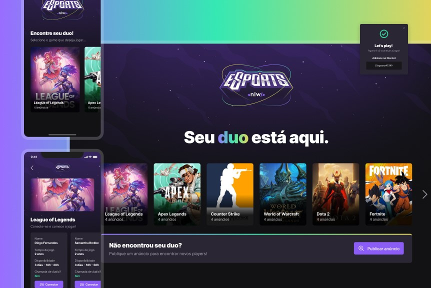

<p align="center">
</p>

# :pushpin: Table of Contents

* [Features](#rocket-features)
* [Installation](#construction_worker-installation)
* [License](#closed_book-license)

<br>

# :rocket: Features

The project is called *Find your Duo*.
It is a platform to find the perfect partner to play your favorite game together, by connecting your Discord account.

<p align="center">
</p>

## :rocket: Stack and tools
* [Node.js](https://nodejs.org/en/)
* [Prisma](https://www.prisma.io/)
* [React](https://reactjs.org/)
* [React Native](https://reactnative.dev/)
* [Expo](https://expo.dev/)
* [Figma](https://www.figma.com/)
* [Radix UI](https://www.radix-ui.com/)


# :construction_worker: Installation
**You need to install [Node.js](https://nodejs.org/en/download/), then in order to clone the project via HTTPS, run this command:**

### Server

First, create a new ``.env`` file on the root directory, using the `.env.example` template as base.

Then, to create the local db run:
```sh
$ cd server
$ npm install
$ npm run db:migrate
```

After that, to start the server, run:
```sh
$ npm run dev
```

### Web

To run the local Vite web client:
```sh
$ cd web
$ npm install
$ npm run dev
```

### Mobile

Configure on you local machine, base on your operating system:
```sh
$ cd mobile
$ npm install
$ expo start
```

# :construction: Work in Progress

This project is still under progress, feel free to contribute.

# :closed_book: License

Released in 2022.
This project is under the [MIT license](https://github.com/Artur-Ceschin/NLW-eSports/main/LICENSE).

Made by [Artur Ceschin](https://github.com/Artur-Ceschin)🚀

Inspired by [Laura Beatris README](https://github.com/LauraBeatris)